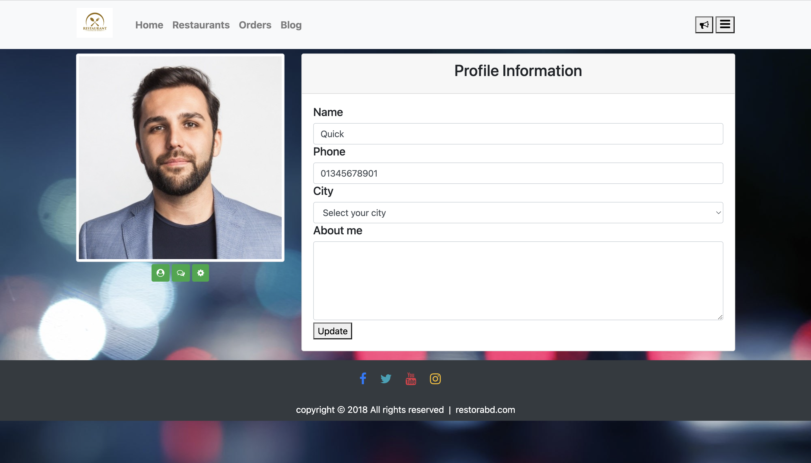
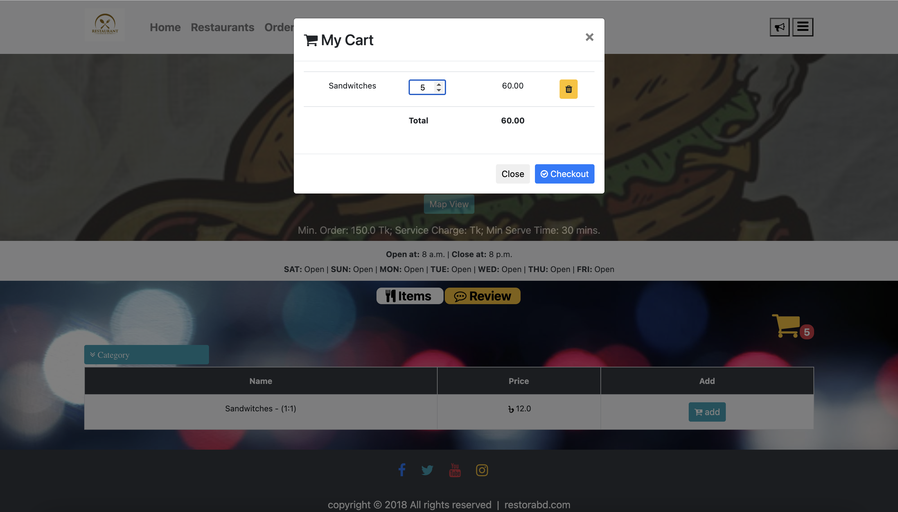
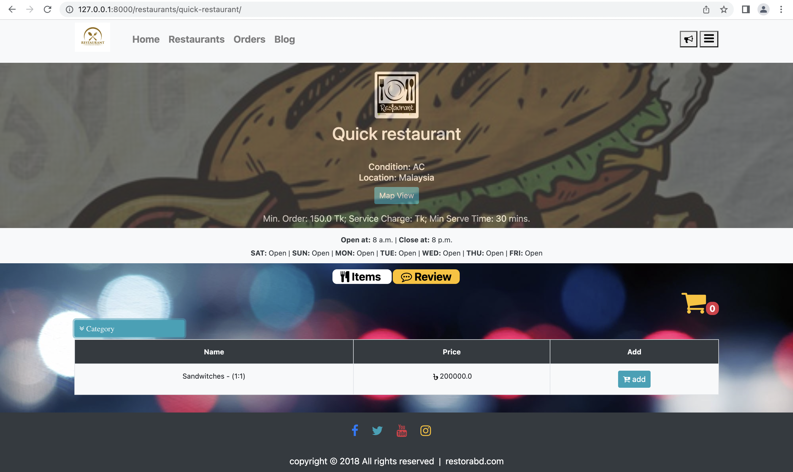
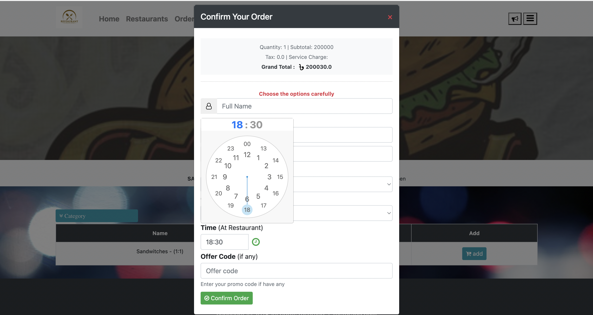
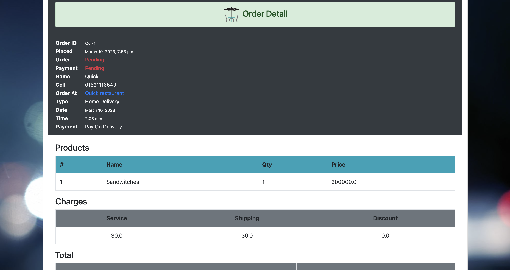
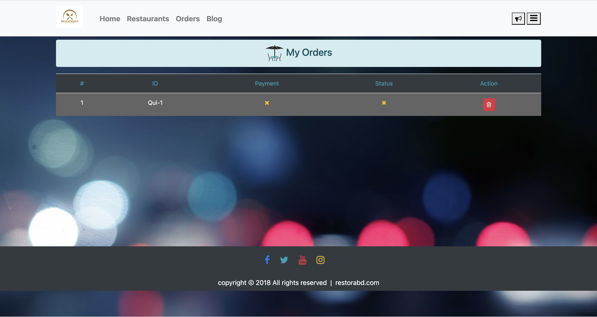

# Restaurant Ordering System

---

## Features

* Cart
* Order confirmation
* Promo Token
* Login/Registration
* **Restaurants**
    * Profile
    * Food menu
    * Rating/reviews
* Search
* My Orders Dashboard
* Notifications
* Profile
* My Reviews
* Admin Order management dashboard **(Only for superuser)**
* etc...

---

## Used Technologies

* Python
* Django v1.11: **upgraded to v2.2.4**
* SQLite3
* HTML
* CSS
* Bootstrap
* ClockPicker
* Font-Awesome
* JavaScript
    * **jQuery**
        * Ajax
    * Notify.js
    * jQueryMyCart.js
    * Wow.js

---

### Activate virtualenv

Linux

```bash
source bin/activate
```

Windows

```bash
.\Scripts\activate
```

### Install reequirements.txt

```bash
python -m pip install -r requirements.txt
```

### go to restorabd directory

```bash
cd restorabd/
```

### create db models.

```bash
python manage.py migrate
```

### Run dev server at port 8888.

```bash
python manage.py runserver 8888
```

* now go to http://127.0.0.1:8888/

---

# SCREENSHOTS

## 01


---

## 02


---

## 03


---

## 04


---

## 05


---

## 06


---

## 07


---

## 08


---

## 09


---

